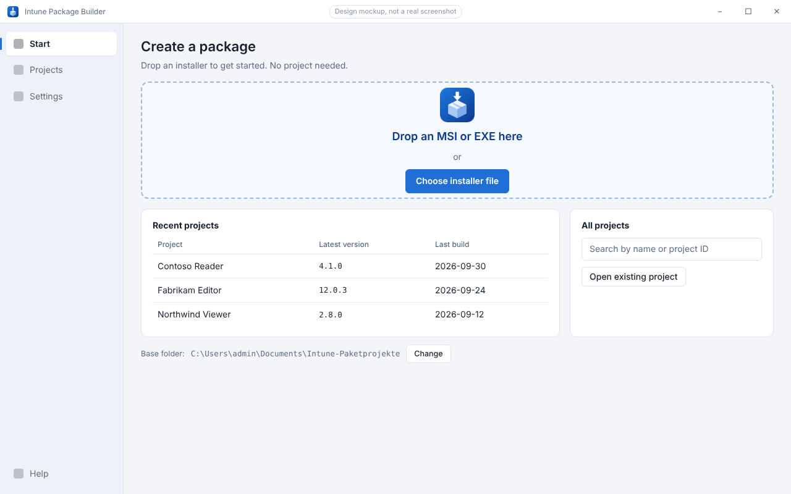
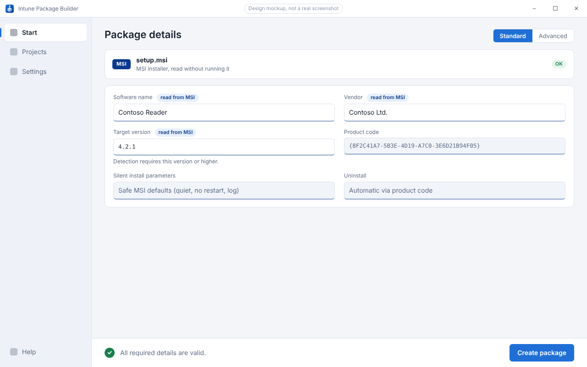
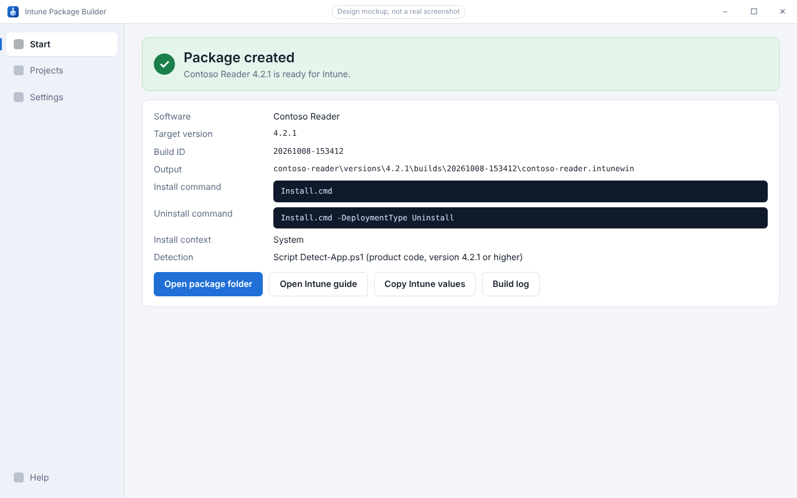

<p align="center">
  
</p>

<h1 align="center">Intune Package Builder</h1>

<p align="center">
  From installer to Intune package.<br>
  <a href="README.md">Deutsch</a> · <a href="https://magicalwig34653.github.io/IntunePackager/">Website</a> · <a href="docs/SPEC.md">Specification (German)</a> · <a href="docs/PLANUNG.md">Planning (German)</a>
</p>

<p align="center">
  <a href="https://github.com/MagicalWig34653/IntunePackager/actions/workflows/ci.yml"></a>
  
  
  <a href="LICENSE"></a>
</p>

> **Project status:** project scaffold with CI is in place (M0 done), features start with M1. There is no release yet. The images below are **design mockups**, not screenshots of a working program.

Intune Package Builder is a Windows desktop application that turns an MSI, an EXE or a vendor folder into a complete Microsoft Intune Win32 package:

> Drop the installer → check the details → build the package → copy file and settings into Intune.

The result is a `.intunewin` file, a standalone detection script and a setup guide that matches that exact build.

<p align="center">
  
</p>

## Planned features

- **Standard mode** with file picker and drag and drop. An MSI needs no technical input; for an EXE the vendor's parameters are asked for, never guessed.
- **Advanced mode** for vendor folders, MSI properties, apps that must be closed, timeout and return codes.
- **Projects and versions** in a base folder of your choice, with notes and reuse of settings for updates.
- **Real detection** of the installed state (product code or file version), independent of the Intune cache.
- **Safe behavior on the target device:** LocalSystem, native 64-bit PowerShell, progress window, no forced process termination or restarts.
- **Traceable builds** with a configuration snapshot, source checksums and a build manifest.
- **German and English:** the interface, the Intune guide and user notices follow the program language.

<p align="center">
  
  
</p>

Out of scope for version 1: direct Intune upload, Graph sign-in, group assignments, MSIX/Store, driver packages, per-user installs, license activation and arbitrary multi-step install scripts. See the [specification](docs/SPEC.md) (German) for details.

## Roadmap

| M | Content | State |
|---|---|---|
| M0 | Solution scaffold, Windows CI, logging foundation, Pester scaffold, format check | done |
| M1 | Core: project model, atomic saving, migration, locks | next |
| M2 | Source analysis: MSI reader, EXE metadata, manifests, safe import | planned |
| M3 | Generators: detection script, Intune guide, JSON/CSV | planned |
| M4 | Build pipeline with the Content Prep Tool | planned |
| M5 | Client runtime: wrapper, return codes, user interaction | planned |
| M6 | UI: standard mode, drag and drop, results | planned |
| M7 | Advanced mode, project view, update flow | planned |
| M8 | Distribution, documentation, device test protocol | planned |
| M9 | Optional: Intune upload via Microsoft Graph (not part of version 1) | noted |

The matching acceptance checks A01–A18 are listed in the [acceptance matrix](docs/ABNAHME-MATRIX.md) (German).

## Repository

```text
src/      Authoring tool (C# / WPF, .NET Framework 4.8) in separate modules
deploy/   Client runtime: wrapper templates and pinned third-party library (planned, M5)
tools/    Win32 Content Prep Tool with provenance and checksum manifest (planned, M4)
tests/    xUnit exists; Pester and UI tests planned
docs/     Specification, planning, acceptance matrix, data format, work status (German)
assets/   App icon (SVG, PNG, ICO)
design/   Sources of the design mockups
site/     GitHub Pages website
```

User projects and vendor installers do not belong in this repository (see `.gitignore`). Third-party components are listed in [THIRD-PARTY.md](THIRD-PARTY.md).

## Development

- **Source code is English throughout:** identifiers, comments, log messages, configuration and workflows. User-visible text comes only from resource files (German and English). The documentation under `docs/` is in German.
- Build and test on Windows (`dotnet build IntunePackageBuilder.sln`, `dotnet test IntunePackageBuilder.sln`). CI runs on `windows-latest` and `windows-2022`.
- The website lives in `site/` and is published by GitHub Actions when `site/` changes on `main`.

## License

[GNU Affero General Public License v3.0](LICENSE). This project is not affiliated with Microsoft. "Intune" and "Windows" are trademarks of Microsoft Corporation.
