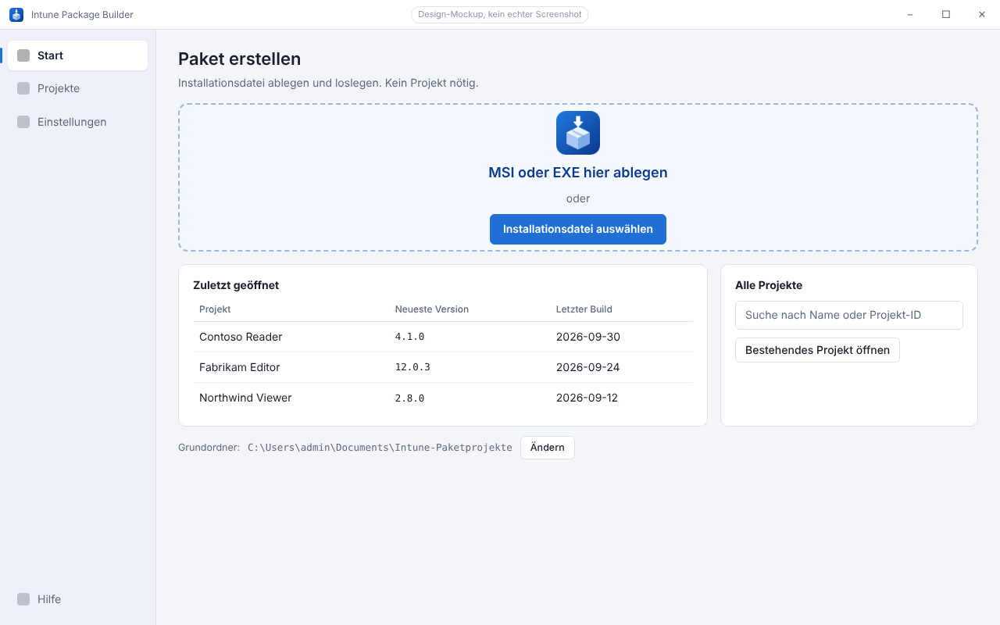
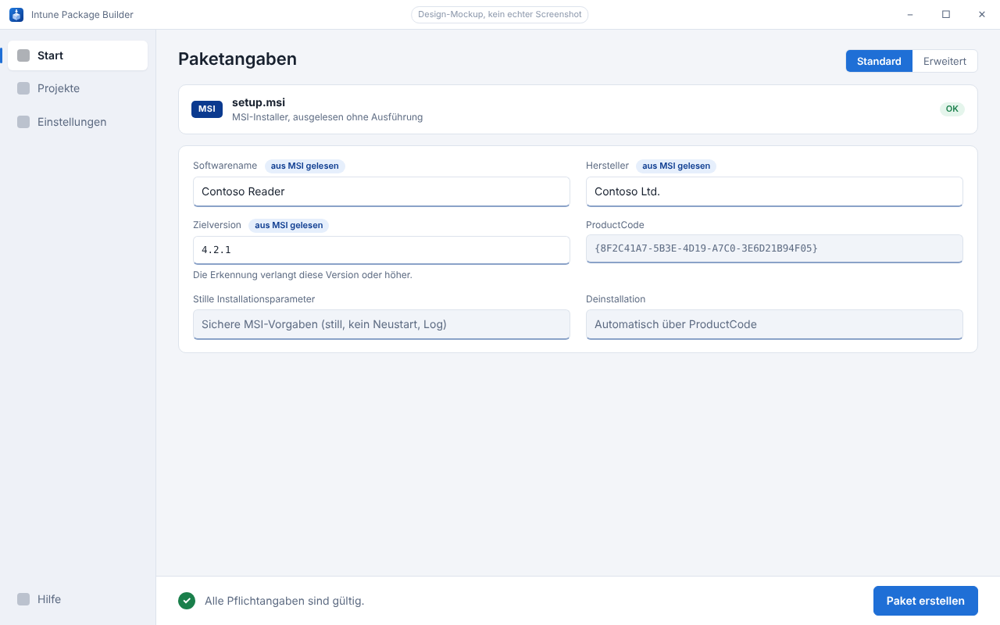
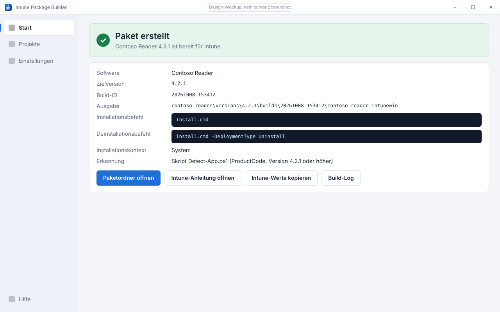

<p align="center">
  
</p>

<h1 align="center">Intune Package Builder</h1>

<p align="center">
  Vom Installer zum Intune-Paket.<br>
  <a href="README.en.md">English</a> · <a href="https://magicalwig34653.github.io/IntunePackager/">Webseite</a> · <a href="docs/SPEC.md">Spezifikation</a> · <a href="docs/PLANUNG.md">Planung</a>
</p>

<p align="center">
  <a href="https://github.com/MagicalWig34653/IntunePackager/actions/workflows/ci.yml"></a>
  
  
  <a href="LICENSE"></a>
</p>

> **Projektstand:** Projektgerüst und Core (Projekte, Versionen, Sperren, Einstellungen) stehen und sind per Windows-CI getestet (M0 und M1 fertig). Die Anwendung hat noch keine nutzbaren Funktionen, und es gibt kein Release. Die Bilder unten sind **Design-Mockups**, keine Screenshots eines lauffähigen Programms.

Der Intune Package Builder ist eine Windows-Desktopanwendung, die aus einer MSI, einer EXE oder einem Herstellerordner ein vollständiges Microsoft-Intune-Win32-Paket erstellt:

> Installationsdatei ablegen → Angaben prüfen → Paket erstellen → Datei und Einstellungen nach Intune übernehmen.

Das Ergebnis besteht aus einer `.intunewin`-Datei, einem eigenständigen Erkennungsskript und einer Einrichtungsanleitung, die genau zu diesem Build passt.

<p align="center">
  
</p>

## Geplante Funktionen

- **Standardmodus** mit Dateiauswahl und Drag-and-drop. Für eine MSI sind keine technischen Eingaben nötig, bei einer EXE werden Herstellerangaben abgefragt statt geraten.
- **Erweiterter Modus** für Herstellerordner, MSI-Eigenschaften, zu schließende Programme, Zeitlimit und Rückgabecodes.
- **Projekte und Versionen** in einem frei wählbaren Grundordner, mit Notizen und der Übernahme von Einstellungen bei Updates.
- **Echte Erkennung** des installierten Zustands (ProductCode bzw. Dateiversion), unabhängig vom Intune-Cache.
- **Sicheres Verhalten auf dem Zielgerät:** LocalSystem, native 64-Bit-PowerShell, Fortschrittsfenster, keine erzwungenen Prozessbeendigungen oder Neustarts.
- **Nachvollziehbare Builds** mit Konfigurationssnapshot, Quellenprüfsummen und Build-Manifest.
- **Deutsch und Englisch:** Oberfläche, Intune-Anleitung und Benutzerhinweise folgen der Programmsprache.

<p align="center">
  
  
</p>

Nicht Teil von Version 1: direkter Upload nach Intune, Graph-Anmeldung, Gruppenzuweisungen, MSIX/Store, Treiberpakete, benutzerspezifische Installationen, Lizenzaktivierung und beliebige mehrstufige Installationsskripte. Details stehen in der [Spezifikation](docs/SPEC.md).

## Fahrplan

| M | Inhalt | Stand |
|---|---|---|
| M0 | Solution-Gerüst, Windows-CI, Logging-Grundlage, Pester-Gerüst, Format-Prüfung | fertig |
| M1 | Core: Projektmodell, atomares Speichern, Migration, Sperren, Einstellungen | fertig |
| M2 | Quellenanalyse: MSI-Reader, EXE-Metadaten, Manifeste, sicherer Import | als Nächstes |
| M3 | Generatoren: Erkennungsskript, Intune-Anleitung, JSON/CSV | geplant |
| M4 | Build-Pipeline mit dem Content Prep Tool | geplant |
| M5 | Client-Laufzeit: Wrapper, Rückgabecodes, Benutzerinteraktion | geplant |
| M6 | Oberfläche: Standardmodus, Drag-and-drop, Ergebnisse | geplant |
| M7 | Erweiterter Modus, Projektansicht, Update-Ablauf | geplant |
| M8 | Distribution, Dokumentation, Geräte-Prüfprotokoll | geplant |
| M9 | Optional: Intune-Upload per Microsoft Graph (nicht Teil von Version 1) | vorgemerkt |

Die zugehörigen Abnahmeprüfungen A01–A18 stehen in der [Abnahme-Matrix](docs/ABNAHME-MATRIX.md).

## Repository

```text
src/      Autorentool (C# / WPF, .NET Framework 4.8) in getrennten Modulen
deploy/   Client-Laufzeit: Wrapper-Vorlagen und gepinnte Drittanbieter-Bibliothek (geplant, M5)
tools/    Win32 Content Prep Tool samt Herkunfts- und Prüfsummenmanifest (geplant, M4)
tests/    xUnit vorhanden; Pester und UI-Tests geplant
docs/     Spezifikation, Planung, Abnahme-Matrix, Datenformat, Arbeitsstand
assets/   App-Icon (SVG, PNG, ICO)
design/   Quellen der Design-Mockups
site/     GitHub-Pages-Webseite
```

Benutzerprojekte und Herstellerinstaller gehören nicht in dieses Repository (siehe `.gitignore`). Verwendete Drittanbieter-Komponenten stehen in [THIRD-PARTY.md](THIRD-PARTY.md).

## Entwicklung

- **Quellcode ist durchgehend Englisch:** Bezeichner, Kommentare, Logmeldungen, Konfiguration und Workflows. Sichtbare Texte kommen ausschließlich aus Ressourcendateien (Deutsch und Englisch). Die Dokumentation unter `docs/` ist deutsch.
- Gebaut und getestet wird auf Windows (`dotnet build IntunePackageBuilder.sln`, `dotnet test IntunePackageBuilder.sln`). Die CI läuft auf `windows-latest` und `windows-2022`.
- Die Webseite liegt in `site/` und wird bei Änderungen an `site/` auf `main` per GitHub Actions veröffentlicht.

## Lizenz

[GNU Affero General Public License v3.0](LICENSE). Dieses Projekt steht in keiner Verbindung zu Microsoft. „Intune“ und „Windows“ sind Marken der Microsoft Corporation.
